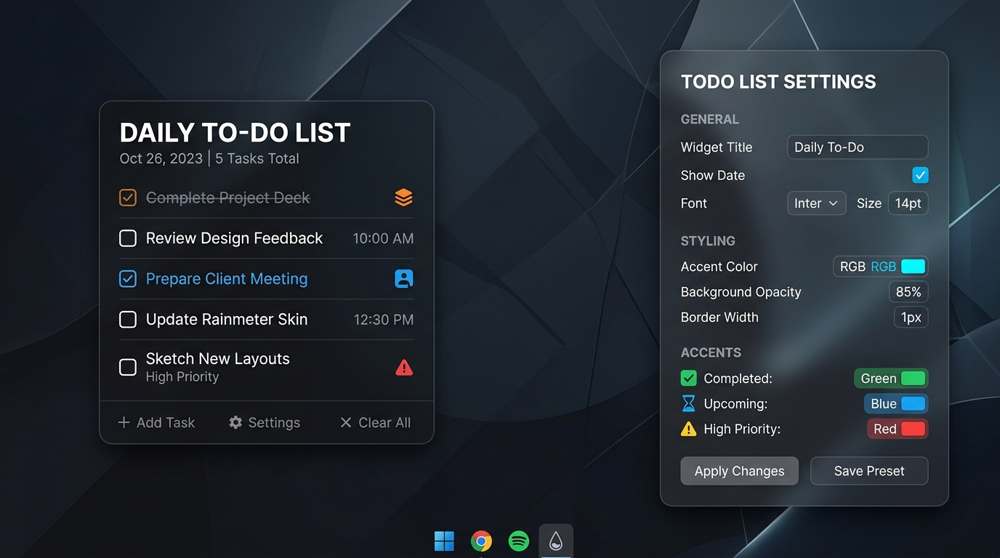

# 📝 Rainmeter To-Do List Pro

<p align="center">
  
  
  
  
</p>

<p align="center">
  
</p>

A modern, ultra-minimalist, and ergonomic **To-Do List** desktop skin for **[Rainmeter](https://www.rainmeter.net/)**. Designed with clean desktop aesthetics, automatic mathematical proportional scaling, configurable organic animations, a native Windows RGB color picker, and a comprehensive settings panel.

---

## ✨ Key Features

### 🎨 Visuals & Ergonomics
- **Minimalist Desktop Design:** Clean, distraction-free floating widget without heavy boxes or visual clutter.
- **Transparent & Glassmorphism Modes:** Choose between a sleek dark translucent glass card or a 100% transparent background.
- **Mathematical Proportional Scaling:** Changing the font size (`AppFontSize`) automatically and harmoniously recalculates all geometric dimensions (row heights, paddings, checkbox sizes, action icons, trash bins, and input text bounds).
- **Centered Optical Alignment:** Checkbox glyphs and task text share the exact optical midline across all font sizes and styles.
- **Bold Text Toggle:** Instant switch to enable or disable bold task typography.

### 🌊 Animations & Fluidity
- **Organic Scale Pulse (Breathing Effect):** Tasks and checkboxes feature a subtle, smooth scale breathing animation rendered at 60 FPS.
- **Vertical Floating Oscillation:** Configurable floating effect for tasks.
- **Click Stability:** The background container and sidebar action column stay 100% anchored and static; checkboxes scale harmoniously while locking their Y-axis for crisp, reliable clicking.

### ⚙️ Interactive Settings Modal
- **13 Interactive Configuration Rows with Hover Highlights:**
  - `Font`: In-place input to set any installed font family (*Segoe UI, Roboto, Inter, Arial, etc.*).
  - `Size`: Proportional dynamic resizing of the entire widget.
  - `Bold Text`: Fast toggle (*ENABLED / DISABLED*).
  - `Text Color`: Opens the **native Windows RGB ColorDialog Picker** (or right-click to enter RGB values manually).
  - `Width`: Adjust widget width in pixels.
  - `Background Color`: Opens the native Windows RGB Color Picker for panel background.
  - `Background Opacity`: Fine-tuned transparency slider from `0` to `255`.
  - `Transparent Background`: One-click toggle (*ON / OFF*).
  - `Buttons Opacity`: Discrete visibility control for action icons (`0` to `255`, with auto-reveal on hover).
  - `Checkbox Style`: Switch between square boxes and circular check marks.
  - `Sound Effects`: Audio toggle for task completion and deletion chimes.
  - `Task Oscillation`: Amplitude control for vertical floating motion.
  - `Task Scale Pulse`: Amplitude control for text breathing animation.
- **Auto-Refresh on Close:** Whenever the settings window is dismissed, the To-Do skin automatically recalculates metrics and refreshes in real-time.

---

## 🕹️ Sidebar Controls & Shortcuts

The subtle action column positioned on the right provides quick one-click actions:

| Icon | Action | Description |
| :---: | :--- | :--- |
| `+` | **Add Task** | Opens the in-place text input field (`Enter` saves, `Esc` cancels). |
| `fa-refresh` | **Refresh** | Manually synchronizes tasks and re-renders visual meters. |
| `fa-trash` | **Clear Completed** | Instantly purges all checked tasks in one click. |
| `fa-cog` | **Settings** | Opens the customization panel. |

---

## 📥 Installation

1. Ensure **[Rainmeter](https://www.rainmeter.net/)** (version 4.5 or newer) is installed.
2. Clone or download this repository directly into your Rainmeter skins directory:
   ```bash
   git clone https://github.com/wenderfl/todo-rainmeter.git "%USERPROFILE%\Documents\Rainmeter\Skins\rainmeter-todo-list"
   ```
3. Open the **Rainmeter Manage** window and click **Refresh all**.
4. Navigate to `rainmeter-todo-list` > `todo` > `todo.ini` and click **Load**.

---

## 📂 Project Structure

```text
rainmeter-todo-list/
├── @Resources/
│   ├── DynamicMeters.inc       # Dynamically generated meters
│   ├── FontAwesome.inc         # Unicode mappings for FontAwesome glyphs
│   ├── Variables.inc           # Active configuration variables
│   ├── MeasureDynamicTasks.lua # Lua backend: JSON parser, dynamic metrics, and animations
│   ├── pick_color.ps1          # PowerShell helper for Windows native RGB ColorDialog
│   ├── json.lua                # Lightweight Lua JSON library
│   ├── complete.wav            # Task completion sound effect
│   └── delete.wav              # Task deletion sound effect
├── assets/
│   └── preview.jpg             # Showcase preview image
├── config/
│   └── config.ini              # Settings modal user interface
├── todo/
│   ├── tasks.json              # Persistent task data storage
│   └── todo.ini                # Main To-Do widget
└── README.md                   # Project documentation
```

---

## 👏 Credits & Acknowledgements

- This project is inspired by and based on the original work by **[alperenozlu/rainmeter-todo](https://github.com/alperenozlu/rainmeter-todo)**.
- Thanks to the **Rainmeter** community and the creators of the **FontAwesome** icon suite.

---

## 📄 License

This project is licensed under the [MIT](LICENSE) License.
